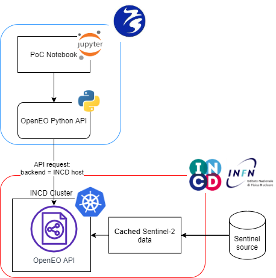

# use-case-aquamonitor

[](https://replay.notebooks.egi.eu/v2/gh/c-scale-community/use-case-aquamonitor/HEAD?labpath=notebooks%2Faquamonitor.ipynb)

With this notebook a user can easily deploy a workflow that produces satellite derived land surface changes for a geographic area of interest. The resultant output of the workflow visualises where surface water has become land (due to accretion, land reclamation, droughts) or vice versa where land has become surface water (due to erosion, reservoir construction).

The service is based on the paper by Donchyts et al. (2016): "Earth's surface water change over the past 30 years". More information about the application can be found at https://www.deltares.nl/en/software/aqua-monitor/. And a Google Earth Engine implementation of the application can be found at https://aqua-monitor.appspot.com/

Here the application is ported to an open source workflow, leveraging OpenEO and tooling available in the C-SCALE federation, as an alternative to Google Earth Engine.

## Architecture



## Local Docker Image
You can either use binder, or build a notebook image locally

to build:
```
docker build -t aquamonitor docker
```

to run:
```
docker run -p 8888:8888 -v $(pwd):/home/jovyan/work aquamonitor
```

Copy the output from the docker run command in your browser:
http://127.0.0.1:8888/?token=xxx

# Binder

You can also run the Aquamonitor notebook using
[EGI Replay](https://replay.notebooks.egi.eu/v2/gh/c-scale-community/use-case-aquamonitor/HEAD?labpath=notebooks%2Faquamonitor.ipynb).

Pre-requisites:
* Create an [EGI Account](https://docs.egi.eu/users/aai/check-in/signup/)
* Enroll the `vo.notebooks.egi.eu` Virtual Organisation following this link: 
  https://aai.egi.eu/registry/co_petitions/start/coef:111
